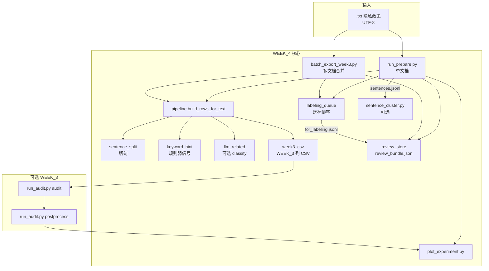

# WEEK_4 隐私政策实验：完整工作流说明

本文描述从**原始隐私政策文本**到**句子级数据、送标与评审 JSON、可选聚类、统计图表、以及可选的 WEEK_3 一致性审计**的端到端流程。默认一键脚本输入为 `WEEK_4/src/data/*.txt`（UTF-8）；单文件实验也可指向 `ref/privacy_policy/...` 下任意 `.txt`。

---

## 1. 流程总览（逻辑顺序）



**一句话**：文本 → 切句 → 每句 `keyword_hint` → 可选 LLM 得到 `pii_related` → 写出 JSONL/统计/可选 WEEK_3 CSV → 可选送标 JSONL 与评审总包 → 可选句向量聚类 → 图表；CSV 可再接 WEEK_3 `run_audit`。

---

## 2. 各阶段说明

| 阶段 | 脚本 / 模块 | 输入 | 输出 | 作用 |
|------|-------------|------|------|------|
| 切句 | `sentence_split.py` | 政策全文字符串 | 句子列表 | `split_policy_text`；`--max-chars` 控制合并碎片 |
| 规则 | `keyword_hint.py` | 单句文本 | 布尔 | 写入 `keyword_hint`，不替代模型/人工 |
| 分类 | `llm_related.py` | 单句 + provider | `ClassifyResult` | `mock` / `ollama` / `deepseek`；JSON 解析入 `pii_related` 等 |
| 编排 | `pipeline.py` | 全文 | 行列表 | 切句循环内打 `keyword_hint`、可选 `classify_sentence` |
| 单文档导出 | `run_prepare.py` | 单个 `.txt` | `sentences.jsonl`、`stats.json`、`manifest.json` | 可选 `--write-week3-csv`、`--export-labeling-queue`、`--export-review-json`、`--labeling-top-n` |
| 批量导出 | `batch_export_week3.py` | 目录内 `.txt` | `all_sentences.jsonl`、`all_sentences_week3_2_2.csv`、`batch_stats.json` | 同上可选送标/评审包；`--max-files` 试跑 |
| 仅送标排序 | `labeling_queue.py` | 已有 JSONL | `for_labeling.jsonl` | 不跑模型；只重排 |
| 评审 JSON | `review_store.py` | JSONL 或已有 bundle | `review_bundle.json` 等 | `init` / `split` / `merge` / `validate` / `stats` |
| 聚类（可选） | `sentence_cluster.py` | `sentences.jsonl` | `sentences_clustered.jsonl`、`cluster_summary.json`、图 | 需 `requirements-optional.txt`；嵌入可选 `local`（HF）或 `deepseek-api` |
| 可视化 | `plot_experiment.py` | 含 `stats.json` 的实验目录 | `figures/*.png`、`summary_metrics.csv` | 可选 `--audit-processed-csv` |
| 可选审计 | `WEEK_3/.../run_audit.py` | `sentences_week3_2_2.csv` | `audit_raw.csv` → `audit_processed.csv` | 占位 DS vs 单句 PP；探索性 |

**注意**：WEEK_3 `run_audit` 原设计是「整段 Data Safety vs 整段政策」。句子表中是**逐句**政策 + **占位** Data Safety，结果宜作为**探索性**指标；应用级审计需换成真实 DS 与全文政策（参见 `README.MD` 第 5.8 节）。

---

## 3. 输出目录结构

### 3.1 单次 `run_prepare.py`（示例 `out/soul_week3/`）

| 路径 | 说明 |
|------|------|
| `sentences.jsonl` | 每句一行 JSON：`doc_id`、`sent_index`、`text`、`pii_related`、`confidence`、`keyword_hint`、`raw_model_output` |
| `stats.json` | 计数与占比 |
| `manifest.json` | 运行参数与 `stats_summary`；若启用则含 `labeling_queue`、`review_bundle` |
| `sentences_week3_2_2.csv` | 需 `--write-week3-csv` |
| `for_labeling.jsonl` | 需 `--export-labeling-queue` |
| `review_bundle.json` | 需 `--export-review-json`（与送标同序、同 `--labeling-top-n`） |

### 3.2 批量 `batch_export_week3.py`（示例 `out/batch_run/`）

| 路径 | 说明 |
|------|------|
| `all_sentences.jsonl` | 合并所有文档句子 |
| `all_sentences_week3_2_2.csv` | 合并 CSV |
| `batch_stats.json` | 汇总 + `by_file`；可含 `labeling_queue`、`review_bundle` |
| `for_labeling.jsonl` / `review_bundle.json` | 同上，可选 |

### 3.3 可选聚类输出目录（`sentence_cluster.py --output-dir`）

嵌入来源：`--embed-backend local`（默认，依赖 Hugging Face 下载模型；超时见 `README.MD` 中 `HF_ENDPOINT` 镜像）或 `deepseek-api`（`POST .../v1/embeddings`，**不是** `deepseek-chat`；需 `DEEPSEEK_API_KEY`，模型名以官方为准）。

| 路径 | 说明 |
|------|------|
| `sentences_clustered.jsonl` | 原字段 + `umap_x`、`umap_y`、`cluster_id`、`is_cluster_noise` |
| `cluster_summary.json` | 簇规模、示例句、噪声索引、`embed_backend`、嵌入模型名等 |
| `umap_hdbscan.png` | 散点图（`--no-plot` 可关） |

### 3.4 `run_full_pipeline.ps1` 默认布局

执行后通常在 `WEEK_4/out/pipeline_<时间戳>/` 下**按文档名分子目录**：

```
out/pipeline_20260406_153000/
├── pipeline_summary.json
├── Soul/
│   ├── sentences.jsonl
│   ├── stats.json
│   ├── manifest.json
│   ├── sentences_week3_2_2.csv
│   ├── audit_raw.csv          # 仅 -RunAudit
│   ├── audit_processed.csv
│   └── figures/
│       ├── stats_counts.png
│       ├── sentence_length_hist.png
│       ├── audit_positive_counts.png
│       └── summary_metrics.csv
└── OtherApp/
    └── ...
```

当前一键脚本**未**默认打开 `--export-labeling-queue` / `--export-review-json`；需要时在 `run_prepare.py` 参数中自行追加（或跑完后再执行 `labeling_queue.py` / `review_store.py init`）。

---

## 4. 人工评审 JSON 简短流程

1. 生成 `review_bundle.json`（`run_prepare.py --export-review-json` 或 `python review_store.py init --from-jsonl ...`）。  
2. 编辑每条 `human.pii_related`（`true`/`false`）、可选 `notes`、`reviewer_id`、`reviewed_at`。  
3. `python review_store.py validate --bundle ...`；`stats` 查看与 AI 一致/分歧计数。  
4. 大文件可 `split` 后只分发 `human_evaluations.json`，回收后 `merge` 回总包。

与课程任务定义对齐说明见 `README.MD` 中评审相关小节及 `llm_related.py` 内系统提示。

---

## 5. 使用 DeepSeek Chat API 的全流程（`deepseek-chat`）

1. 在 [DeepSeek 开放平台](https://platform.deepseek.com/) 创建 API Key。  
2. **不要**把 Key 写进仓库；在终端会话中设置环境变量（PowerShell）：

```powershell
$env:DEEPSEEK_API_KEY = "sk-你的密钥"
```

3. **方式 A：一键脚本**（切句 + 每句 PII 分类 + 可选 WEEK_3 audit + 出图）：

```powershell
cd "D:\LEARNING_RESOURCE\AndroidPDS\gitRepository\Android-Privacy-Detection-Software\WEEK_4\src"

# 建议先用 -ClassifyLimit / -AuditLimit 试跑，再取消限制跑全量（费用与耗时随句数线性增长）
.\run_full_pipeline.ps1 `
  -PrepareMode classify `
  -Provider deepseek `
  -DeepSeekModel deepseek-chat `
  -ClassifyLimit 20 `
  -RunAudit `
  -AuditLimit 20
```

4. **方式 B：分步命令**（便于自定义路径）。将 `OUT`、`REPO` 换成你的目录；`Soul.txt` 放在 `WEEK_4/src/data/`。

```powershell
$env:DEEPSEEK_API_KEY = "sk-..."
$REPO = "D:\LEARNING_RESOURCE\AndroidPDS\gitRepository\Android-Privacy-Detection-Software"
$SRC = Join-Path $REPO "WEEK_4\src"
$OUT = Join-Path $REPO "WEEK_4\out\deepseek_run"

Set-Location $SRC

# (1) 句子级 PII 相关分类（WEEK_4）
python run_prepare.py `
  --input (Join-Path $SRC "data\Soul.txt") `
  --output-dir (Join-Path $OUT "Soul") `
  --write-week3-csv `
  --mode classify `
  --provider deepseek `
  --deepseek-model deepseek-chat `
  --limit 20

# (2) 图表与 summary_metrics.csv
python plot_experiment.py --experiment-dir (Join-Path $OUT "Soul")

# (3) WEEK_3 Data Safety vs 单句政策（可选）
Set-Location (Join-Path $REPO "WEEK_3\src\2-2")
python run_audit.py audit `
  --input-csv (Join-Path $OUT "Soul\sentences_week3_2_2.csv") `
  --output-csv (Join-Path $OUT "Soul\audit_raw.csv") `
  --provider deepseek `
  --deepseek-model deepseek-chat `
  --limit 20 `
  --log-file (Join-Path $OUT "Soul\audit.log")

python run_audit.py postprocess `
  --input-csv (Join-Path $OUT "Soul\audit_raw.csv") `
  --output-csv (Join-Path $OUT "Soul\audit_processed.csv") `
  --log-file (Join-Path $OUT "Soul\postprocess.log")

# (4) 叠加 audit 统计图
Set-Location $SRC
python plot_experiment.py `
  --experiment-dir (Join-Path $OUT "Soul") `
  --audit-processed-csv (Join-Path $OUT "Soul\audit_processed.csv")
```

**参数说明**：WEEK_4 与 WEEK_3 均使用官方 Chat Completions 地址，默认 `https://api.deepseek.com/chat/completions`；模型名 **`deepseek-chat`**。WEEK_4 另支持 `--deepseek-api-key` 覆盖环境变量（不推荐在共享屏幕下使用）。超时可用 `run_prepare.py --timeout 120` 调整。

Bash 下可先执行：`export DEEPSEEK_API_KEY=sk-...`。

---

## 6. 一键执行（Ollama / mock 等）

在 `WEEK_4/src` 目录下：

```powershell
.\run_full_pipeline.ps1
```

常用参数见脚本内注释，或：

```powershell
# 使用 mock 对每句打 pii_related，并跑 WEEK_3 audit（前 20 行试跑）
.\run_full_pipeline.ps1 -PrepareMode classify -Provider mock -RunAudit -AuditLimit 20

# 仅切句 + 出图（最快，不跑 WEEK_3 audit）
.\run_full_pipeline.ps1 -PrepareMode split-only
```

CMD 下可使用同目录的 `run_full_pipeline.bat`。

---

## 7. 与 WEEK_3 金标准评估

若需混淆矩阵与 precision/recall，须准备与 `audit_processed.csv` **行对齐**的 groundtruth CSV，再执行 `run_audit.py evaluate --figures-dir ...`（参见 `README.MD` 第 10.2 节）。

---

## 8. 数据放置

将隐私政策纯文本放入：

`WEEK_4/src/data/*.txt`

文件名（不含扩展名）会作为 `doc_id` 及 `run_full_pipeline.ps1` 输出子目录名。单文件实验也可使用 `ref/` 下路径作为 `run_prepare.py --input`。

---

## 9. 与 README 的分工

- **`README.MD`**：实验目的、讲义对应、逐步命令示例、输出字段、个保法对齐、可视化与学术诚信等**课程说明**。  
- **`WORKFLOW.md`**（本文）：**端到端流程图**、模块/阶段表、目录产物清单、DeepSeek 与一键脚本路径约定。
