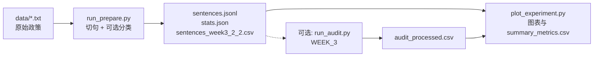

# WEEK_4 隐私政策实验：完整工作流说明

本文描述从**原始隐私政策文本**到**句子级数据、统计图表、以及可选的 WEEK_3 一致性审计**的端到端流程。默认输入目录为 `WEEK_4/src/data/`（放置 UTF-8 编码的 `.txt` 文件）。

## 流程总览



## 各阶段说明

| 阶段 | 脚本 / 命令 | 输入 | 输出 | 作用 |
|------|-------------|------|------|------|
| 1 | `run_prepare.py` | `src/data/*.txt` | 每文档一个子目录 | 断句；计算 `keyword_hint`；可选 LLM 判断 `pii_related`；生成与 WEEK_3 `2-2` 同列的 CSV，供后续比较器或 `run_audit` 使用 |
| 2 | `plot_experiment.py` | 上一步目录中的 `stats.json`、`sentences.jsonl` | `figures/*.png`、`summary_metrics.csv` | 描述性统计与实验报告用图 |
| 3（可选） | `WEEK_3/.../run_audit.py audit` | `sentences_week3_2_2.csv` | `audit_raw.csv` | 将「占位 Data Safety」与**单句**政策送入 WEEK_3 提示模板，得到 `incorrect/incomplete/inconsistent` 的 JSON |
| 4（可选） | `run_audit.py postprocess` | `audit_raw.csv` | `audit_processed.csv` | 拆出三列 0/1，便于统计或 `evaluate` |
| 5（可选） | `plot_experiment.py --audit-processed-csv` | `audit_processed.csv` | `audit_positive_counts.png` | 可视化三类「预测为 1」的句数 |

**注意**：WEEK_3 `run_audit` 原设计是「整段 Data Safety vs 整段政策」。当前句子表中是**逐句**政策 + **占位** Data Safety，结果宜作为**探索性**指标；应用级审计需自行换成真实 Data Safety 与全文政策（单行 CSV）。

## 输出目录结构（一次流水线运行）

执行 `run_full_pipeline.ps1` 后，默认在 `WEEK_4/out/pipeline_<时间戳>/` 下为**每个**输入文件生成：

```
out/pipeline_20260406_153000/
├── pipeline_summary.json      # 本 run 元数据与每文档路径
├── Soul/
│   ├── sentences.jsonl
│   ├── stats.json
│   ├── manifest.json
│   ├── sentences_week3_2_2.csv
│   ├── audit_raw.csv          # 仅当启用 -RunAudit
│   ├── audit_processed.csv
│   └── figures/
│       ├── stats_counts.png
│       ├── sentence_length_hist.png
│       ├── audit_positive_counts.png
│       └── summary_metrics.csv
└── OtherApp/
    └── ...
```

## 使用 DeepSeek Chat API 的全流程（`deepseek-chat`）

1. 在 [DeepSeek 开放平台](https://platform.deepseek.com/) 创建 API Key。  
2. **不要**把 Key 写进仓库；在终端会话中设置环境变量（PowerShell）：

```powershell
$env:DEEPSEEK_API_KEY = "sk-你的密钥"
```

3. **方式 A：一键脚本**（切句 + 每句 PII 分类 + 可选 WEEK_3 audit + 出图）：

```powershell
cd "D:\LEARNING_RESOURCE\AndroidPDS\gitRepository\Android-Privacy-Detection-Software\WEEK_4\src"

# 建议先用 -ClassifyLimit / -AuditLimit 试跑，再取消限制跑全量（费用与耗时随句数线性增长）
.\run_full_pipeline.ps1 `
  -PrepareMode classify `
  -Provider deepseek `
  -DeepSeekModel deepseek-chat `
  -ClassifyLimit 20 `
  -RunAudit `
  -AuditLimit 20
```

4. **方式 B：分步命令**（便于自定义路径）。将 `OUT`、`REPO` 换成你的目录；`Soul.txt` 放在 `WEEK_4/src/data/`。

```powershell
$env:DEEPSEEK_API_KEY = "sk-..."
$REPO = "D:\LEARNING_RESOURCE\AndroidPDS\gitRepository\Android-Privacy-Detection-Software"
$SRC = Join-Path $REPO "WEEK_4\src"
$OUT = Join-Path $REPO "WEEK_4\out\deepseek_run"

Set-Location $SRC

# (1) 句子级 PII 相关分类（WEEK_4）
python run_prepare.py `
  --input (Join-Path $SRC "data\Soul.txt") `
  --output-dir (Join-Path $OUT "Soul") `
  --write-week3-csv `
  --mode classify `
  --provider deepseek `
  --deepseek-model deepseek-chat `
  --limit 20

# (2) 图表与 summary_metrics.csv
python plot_experiment.py --experiment-dir (Join-Path $OUT "Soul")

# (3) WEEK_3 Data Safety vs 单句政策（可选）
Set-Location (Join-Path $REPO "WEEK_3\src\2-2")
python run_audit.py audit `
  --input-csv (Join-Path $OUT "Soul\sentences_week3_2_2.csv") `
  --output-csv (Join-Path $OUT "Soul\audit_raw.csv") `
  --provider deepseek `
  --deepseek-model deepseek-chat `
  --limit 20 `
  --log-file (Join-Path $OUT "Soul\audit.log")

python run_audit.py postprocess `
  --input-csv (Join-Path $OUT "Soul\audit_raw.csv") `
  --output-csv (Join-Path $OUT "Soul\audit_processed.csv") `
  --log-file (Join-Path $OUT "Soul\postprocess.log")

# (4) 叠加 audit 统计图
Set-Location $SRC
python plot_experiment.py `
  --experiment-dir (Join-Path $OUT "Soul") `
  --audit-processed-csv (Join-Path $OUT "Soul\audit_processed.csv")
```

**参数说明**：WEEK_4 与 WEEK_3 均使用官方 Chat Completions 地址，默认 `https://api.deepseek.com/chat/completions`；模型名 **`deepseek-chat`**。WEEK_4 另支持 `--deepseek-api-key` 覆盖环境变量（不推荐在共享屏幕下使用）。超时可用 `run_prepare.py --timeout 120` 调整。

Bash 下可先执行：`export DEEPSEEK_API_KEY=sk-...`。

---

## 一键执行（Ollama / mock 等）

在 `WEEK_4/src` 目录下：

```powershell
.\run_full_pipeline.ps1
```

常用参数见脚本内注释，或：

```powershell
# 使用 mock 对每句打 pii_related，并跑 WEEK_3 audit（前 20 行试跑）
.\run_full_pipeline.ps1 -PrepareMode classify -Provider mock -RunAudit -AuditLimit 20

# 仅切句 + 出图（最快，不跑 WEEK_3 audit）
.\run_full_pipeline.ps1 -PrepareMode split-only
```

CMD 下可使用同目录的 `run_full_pipeline.bat`。

## 与 WEEK_3 金标准评估

若需混淆矩阵与 precision/recall，须准备与 `audit_processed.csv` **行对齐**的 groundtruth CSV，再执行 `run_audit.py evaluate --figures-dir ...`（参见 `README.MD` 第 10.2 节）。

## 数据放置

将隐私政策纯文本放入：

`WEEK_4/src/data/*.txt`

文件名（不含扩展名）会作为 `doc_id` 及输出子目录名。
